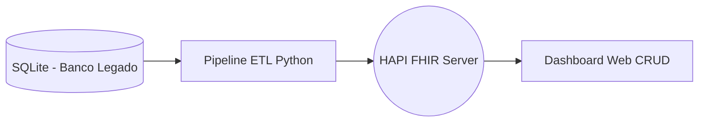

# FHIR Data Engine & Dashboard 🚀

Este projeto é um laboratório completo de **Engenharia de Dados em Saúde**, cobrindo desde a extração de sistemas legados até a visualização em uma aplicação interoperável no padrão **HL7 FHIR**.

## 📋 Visão Geral do Ecossistema

O projeto simula um fluxo real de dados hospitalares, onde resultados de exames laboratoriais são integrados a um servidor central e disponibilizados para uma interface de gestão.



## 🏗️ Pilares Técnicos Abordados

### 1. Engenharia de Dados & ETL
*   **Extração Incremental**: O sistema utiliza controle de estado (coluna `processado`) para garantir que apenas dados novos sejam integrados, evitando duplicidade e economizando processamento.
*   **Transformação de Dados**: Conversão de tipos relacionais para objetos JSON complexos seguindo a especificação FHIR R4.

### 2. FHIR Interoperability (Protocolo)
*   **FHIR Bundles (Transações)**: Implementação de envios atômicos. Todas as observações são empacotadas em uma única transação "tudo ou nada", garantindo a integridade referencial no servidor.
*   **Terminologias Internacionais**: Uso prático de sistemas de codificação padrão:
    *   **LOINC**: Identificação universal de exames laboratoriais.
    *   **UCUM**: Padronização de unidades de medida.
*   **Identificadores RNDS**: Utilização de padrões brasileiros para identificação de pacientes (CPF) e estabelecimentos (CNES).

### 3. Frontend & Aplicação (Dashboard)
*   **Dashboard Moderno**: Interface em *Dark Mode* com *Glassmorphism* para visualização e gestão clínica.
*   **Operações CRUD**: 
    *   **Create**: Inclusão manual de novos registros FHIR via formulário.
    *   **Read**: Consumo da API FHIR com busca em tempo real.
    *   **Update**: Edição de recursos existentes via método `PUT`.
    *   **Delete**: Remoção física de recursos do servidor.

---

## 🛠️ Guia de Instalação e Uso

### 1. Servidor FHIR
Suba o servidor de referência (HAPI FHIR) via Docker:
```bash
docker run -d -p 8080:8080 --name hapi-fhir hapiproject/hapi-fhir-jpaserver-starter
```

### 2. Backend (Pipeline)
1. Instale as bibliotecas: `pip install pandas requests`
2. Prepare o banco legado: `python setup_banco.py`
3. Execute a integração: `python pipeline_rel.py`

### 3. Frontend (Dashboard)
Para evitar bloqueios de segurança (CORS) ao acessar o servidor FHIR:
1. Navegue até a pasta: `cd frontend`
2. Inicie o servidor web: `python -m http.server 3000`
3. Acesse: `http://127.0.0.1:3000`

---

## 📂 Arquivos do Projeto

*   `/frontend`: Dashboard HTML/CSS/JS para gestão dos dados.
*   `setup_banco.py`: Script de criação e mock de dados do sistema hospitalar.
*   `pipeline_rel.py`: Orquestrador de dados (SQL -> FHIR Bundle).
*   `hospital_ses.db`: Banco de dados SQLite simulando o legado.

## 🎓 Objetivos de Aprendizado
Este projeto demonstra a capacidade de um Engenheiro de Dados em Saúde de atuar em todas as camadas: infraestrutura de banco de dados, lógica de transformação e padrões internacionais de interoperabilidade.
